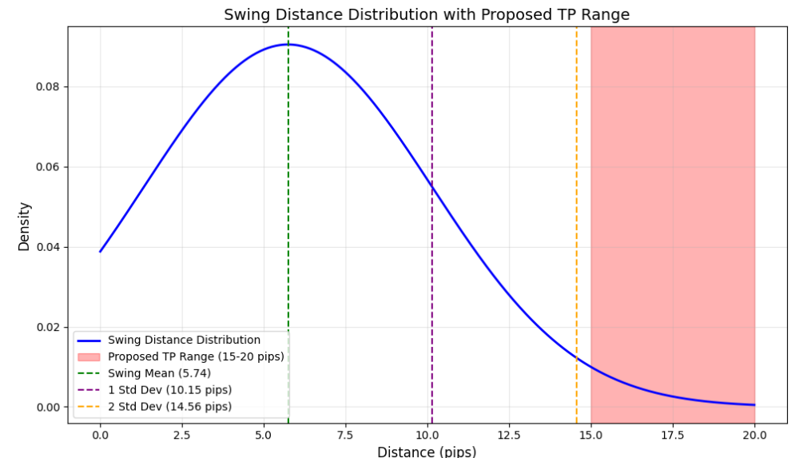

# TP Analysis: Swing Size and Take Profit Recommendations

## Objective
This project analyzes swing size distributions to recommend a statistically meaningful placement for Take Profit (TP) levels.

## Findings
- The current TP level is outside the swing size range, suggesting potential overfitting or an unrealistic strategy.
- The proposed TP range of **15-20 pips** aligns with the observed swing distribution, balancing risk and reward.

## Visualization

## Files
- **analysis.ipynb**: Full analysis and visualizations.
- **TP_plot.png**: Visualization of the proposed TP range.
